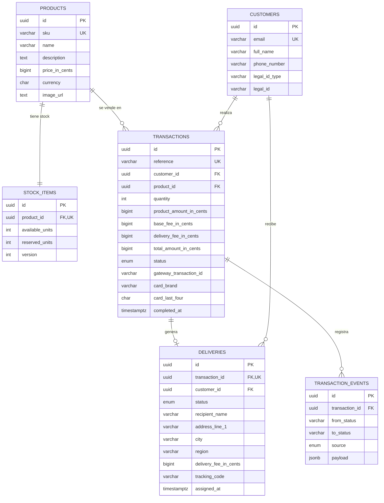

# Payment Checkout

Aplicación fullstack de checkout con pago por tarjeta de crédito: un SPA móvil-first en React
y una API en NestJS con arquitectura hexagonal (Ports & Adapters) y Railway Oriented Programming.

El comprador recorre cinco pantallas — **producto → datos de tarjeta y entrega → resumen →
resultado → producto con el stock actualizado** — y el backend orquesta la reserva de stock, el
cobro contra la pasarela, la asignación de la entrega y la liberación de unidades cuando el pago
no prospera.

## Tabla de contenido

- [Stack](#stack)
- [Puesta en marcha](#puesta-en-marcha)
- [Arquitectura](#arquitectura)
- [Modelo de datos](#modelo-de-datos)
- [API](#api)
- [Flujo de pago](#flujo-de-pago)
- [Manejo de datos sensibles](#manejo-de-datos-sensibles)
- [Tests y cobertura](#tests-y-cobertura)
- [Despliegue](#despliegue)

## Stack

| Capa | Tecnología |
| --- | --- |
| Frontend | React 19 + TypeScript + Vite + **Redux Toolkit** + redux-persist + React Router |
| Backend | **NestJS 11** + TypeScript + TypeORM |
| Base de datos | PostgreSQL (Neon) |
| Tests | **Jest** en ambos workspaces (+ Testing Library en el SPA) |
| Documentación de API | Swagger / OpenAPI |

### Estructura del monorepo

```
payment-checkout/
├── apps/
│   ├── api/                   API NestJS
│   │   ├── src/contexts/      Bounded contexts: catalog, customers, payments, deliveries
│   │   ├── src/shared/        Result (ROP), errores de dominio, config, persistencia
│   │   └── test/fakes/        Dobles de prueba (repositorios en memoria, gateway falso)
│   └── web/                   SPA React
│       ├── src/domain/        Validación de tarjeta y datos de entrega
│       ├── src/features/      Slices de Redux
│       ├── src/pages/         Las pantallas del flujo
│       └── src/api/           Cliente HTTP y tokenización
├── docs/data-model.md         Diagrama ER y decisiones de diseño
└── package.json               npm workspaces
```

## Puesta en marcha

### Requisitos

- Node.js >= 20
- Una base de datos PostgreSQL accesible

### Instalación

```bash
npm install
```

### Variables de entorno

Copia `apps/api/.env.example` a `apps/api/.env` y completa los valores:

```bash
cp apps/api/.env.example apps/api/.env
```

| Variable | Descripción |
| --- | --- |
| `DATABASE_URL` | Cadena de conexión de PostgreSQL |
| `DATABASE_SSL` | `true` en proveedores gestionados; verifica el certificado contra las CA del sistema |
| `CORS_ORIGINS` | Orígenes permitidos, separados por coma |
| `PAYMENT_GATEWAY_BASE_URL` | URL del ambiente sandbox de la pasarela |
| `PAYMENT_GATEWAY_PUBLIC_KEY` | Llave pública (tokenización desde el navegador) |
| `PAYMENT_GATEWAY_PRIVATE_KEY` | Llave privada (creación del cobro, solo servidor) |
| `PAYMENT_GATEWAY_INTEGRITY_KEY` | Secreto para firmar el monto y la referencia |
| `PAYMENT_GATEWAY_EVENTS_KEY` | Secreto para verificar la firma de los webhooks |
| `BASE_FEE_CENTS` | Comisión base, en centavos |
| `DELIVERY_FEE_CENTS` | Costo de envío, en centavos |

La configuración se valida al arrancar: una variable faltante o mal formada detiene el proceso
en lugar de fallar en la primera petición.

### Base de datos

```bash
npm run migration:run --workspace @checkout/api   # crea el esquema
npm run seed                                       # siembra 5 productos de prueba
npm run seed --workspace @checkout/api -- --reset-stock   # restablece el stock
```

### Desarrollo

```bash
npm run dev:api    # API en http://localhost:3000  (Swagger en /docs)
npm run dev:web    # SPA en http://localhost:5173  (proxy /api → :3000)
```

### Scripts

| Script | Descripción |
| --- | --- |
| `npm run build` | Compila API y SPA |
| `npm test` | Ejecuta los tests de ambos workspaces |
| `npm run test:cov` | Tests con reporte de cobertura |
| `npm run lint` | Linting de ambos workspaces |
| `npm run seed` | Puebla la base de datos con productos |

## Arquitectura

### Hexagonal (Ports & Adapters)

Cada bounded context se organiza en tres capas y las dependencias solo apuntan hacia adentro:

```
contexts/<contexto>/
├── domain/              Entidades, value objects, errores y PUERTOS (interfaces)
├── application/         Casos de uso — orquestan el dominio a través de los puertos
└── infrastructure/      ADAPTADORES: repositorios TypeORM, cliente HTTP, controllers
```

El dominio no importa NestJS, TypeORM ni Axios. Los puertos se declaran como símbolos
(`PRODUCT_REPOSITORY`, `PAYMENT_GATEWAY`, `UNIT_OF_WORK`) y el módulo de Nest es el único lugar
donde se decide qué adaptador los implementa, lo que permite sustituirlos por dobles en los tests
sin levantar base de datos ni red.

### Railway Oriented Programming

Los casos de uso **no lanzan excepciones** para fallos esperados: devuelven un
`Result<T, DomainError>` con dos vías. Cualquier paso que falle cortocircuita el resto del
pipeline y la unidad de trabajo revierte la transacción de base de datos.

```ts
const product = await this.products.findById(input.productId, context);
if (!product.ok) return product;

const reserved = lockedStock.value.reserve(input.quantity);
if (!reserved.ok) return reserved;
```

El único punto donde la vía de fallo se convierte en excepción es el borde HTTP
(`unwrapOrThrow`), que traduce el `kind` del error de dominio a un status code:

| `DomainErrorKind` | HTTP |
| --- | --- |
| `Validation` | 400 |
| `NotFound` | 404 |
| `Conflict` | 409 |
| `Unavailable` | 502 |
| `Unexpected` | 500 |

Así el dominio nunca conoce HTTP y los controllers quedan en una línea por endpoint.

### Pasarela de pagos como puerto

La integración vive detrás de `PaymentGatewayPort` (`charge`, `findCharge`,
`getCheckoutConfig`, `verifyEventSignature`). Ningún caso de uso conoce el proveedor: cambiarlo
solo requiere otro adaptador.

## Modelo de datos

PostgreSQL. Los importes se guardan en **centavos** (`BIGINT`) para evitar errores de redondeo,
y toda marca de tiempo es `TIMESTAMPTZ`.



Las decisiones detrás de este esquema — por qué el stock vive en su propia tabla, cómo funciona
la reserva de unidades y qué se guarda de la tarjeta — están detalladas en
[docs/data-model.md](docs/data-model.md).

### Estados

| Tabla | Estados |
| --- | --- |
| `transactions.status` | `PENDING` → `APPROVED` \| `DECLINED` \| `VOIDED` \| `ERROR` |
| `deliveries.status` | `PENDING` → `ASSIGNED` → `SHIPPED` → `DELIVERED` \| `CANCELLED` |

## API

Documentación interactiva en **`/docs`** (Swagger UI) con la API corriendo.
El prefijo es `/api/v1`.

| Método | Ruta | Descripción |
| --- | --- | --- |
| `GET` | `/api/v1/health` | Readiness: proceso vivo y base de datos alcanzable |
| `GET` | `/api/v1/products` | Catálogo con precio y unidades disponibles |
| `GET` | `/api/v1/products/:id` | Detalle de un producto |
| `GET` | `/api/v1/products/:id/stock` | Stock disponible y reservado |
| `GET` | `/api/v1/customers/:id` | Datos de un cliente |
| `GET` | `/api/v1/checkout/config` | Datos públicos para tokenizar la tarjeta y las comisiones |
| `POST` | `/api/v1/transactions` | Crea la transacción en `PENDING` y **reserva el stock** |
| `POST` | `/api/v1/transactions/:reference/payment` | Envía el cobro a la pasarela y liquida el resultado |
| `GET` | `/api/v1/transactions/:reference` | Consulta el estado y **reconcilia** con la pasarela |
| `GET` | `/api/v1/deliveries/:transactionId` | Entrega asociada a una transacción |
| `PATCH` | `/api/v1/deliveries/:transactionId/status` | Avanza el estado logístico |
| `POST` | `/api/v1/payment-events` | Webhook firmado de la pasarela |

### Validaciones

Cada endpoint valida su entrada con `class-validator` y una `ValidationPipe` global configurada
con `whitelist` y `forbidNonWhitelisted`: un payload con campos que la API no declaró se rechaza
en lugar de ignorarse en silencio. Sobre eso, el dominio impone sus propias reglas
(formato de correo y teléfono, tipo de documento, cantidad positiva, dirección completa,
suficiencia de stock, transiciones de estado permitidas).

Todos los errores responden con la misma forma:

```json
{
  "statusCode": 409,
  "code": "INSUFFICIENT_STOCK",
  "message": "No hay unidades suficientes disponibles.",
  "details": { "productId": "…", "requested": 20, "available": 12 },
  "path": "/api/v1/transactions",
  "timestamp": "2026-07-24T22:51:30.154Z"
}
```

## Flujo de pago

```
1. POST /transactions          → transacción PENDING + stock reservado + entrega PENDING
2. Navegador → pasarela        → tokeniza la tarjeta con la llave pública
3. POST /transactions/:ref/payment → cobro con la llave privada y firma de integridad
4. Resultado                   → APPROVED: consume la reserva y asigna la entrega
                                 DECLINED/ERROR/VOIDED: libera las unidades y cancela la entrega
```

### Tarjetas de prueba

El ambiente sandbox de la pasarela **solo tokeniza estos números**; cualquier otro se rechaza
con `El número de tarjeta usado no es aceptado en el ambiente de pruebas`:

| Número | Marca |
| --- | --- |
| `4242 4242 4242 4242` | VISA |
| `4111 1111 1111 1111` | VISA |

Cualquier fecha de expiración futura y cualquier CVC de 3 dígitos sirven.

La detección de marca del formulario sí reconoce Mastercard (y muestra su logo), pero el
sandbox no acepta ninguna tarjeta Mastercard de prueba, así que el pago no puede completarse
con una.

### Por qué se reserva el stock

Entre el paso 1 y el 4 hay una llamada de red que no es instantánea. Sin reserva, dos compradores
podrían pagar la última unidad a la vez. Al crear la transacción las unidades pasan de
`available_units` a `reserved_units` bajo un `SELECT … FOR UPDATE`, y solo el resultado del pago
decide su destino final. La columna `version` añade bloqueo optimista como segunda defensa.

### Resolución asíncrona y reconciliación

Los pagos con tarjeta se resuelven de forma asíncrona: la pasarela suele responder `PENDING` y
confirmar después. Hay dos caminos hacia el estado final, y ambos son idempotentes:

- **Webhook** (`POST /payment-events`) — vía rápida. Se verifica la firma SHA-256 del evento
  antes de aplicarlo y se descartan los eventos duplicados o tardíos.
- **Reconciliación al consultar** (`GET /transactions/:reference`) — vía confiable. Si la
  transacción sigue pendiente, la API le pregunta el estado a la pasarela y la liquida. Esto es
  lo que evita que el stock quede reservado para siempre si el webhook nunca llega, y lo que hace
  que el SPA funcione en desarrollo local, donde el webhook no puede alcanzar la máquina.

Una transacción finalizada rechaza cualquier intento posterior de modificarla, así que el webhook
y el polling pueden llegar en cualquier orden sin corromper el resultado. Un estado desconocido
de la pasarela se trata como `ERROR` para que nada quede colgado en `PENDING`.

### Resiliencia ante refresh

El progreso del checkout y el resultado de la transacción se persisten con `redux-persist`. Si el
comprador recarga la página:

- en el formulario, conserva los datos de entrega ya escritos;
- en el resumen, vuelve al formulario porque **la tarjeta nunca se persiste** (ver abajo);
- en el resultado, la pantalla se reconstruye consultando `GET /transactions/:reference`, así que
  el resultado de un pago ya hecho no se pierde nunca.

## Manejo de datos sensibles

- **El número de tarjeta, la fecha de expiración y el CVC nunca llegan al backend.** El SPA los
  envía directamente a la pasarela con la llave pública y recibe un token de un solo uso; ese
  token es lo único que viaja a nuestra API. Hay un test que verifica que el PAN no aparece en
  ninguna llamada a la API propia.
- **En base de datos solo se guardan `card_brand` y `card_last_four`**, lo mínimo para que el
  comprador reconozca su compra.
- **Los datos de tarjeta tampoco entran al store de Redux**, que es lo que se persiste en
  `localStorage`. Viven en el estado del componente y se descartan al tokenizar.
- La llave privada y los secretos de firma solo existen en el servidor.

### OWASP y cabeceras

- `helmet` con CSP, HSTS (1 año, `includeSubDomains`, `preload`), `X-Content-Type-Options`,
  `Referrer-Policy: no-referrer` y `frame-ancestors 'none'`.
- CORS restringido a la lista de orígenes configurada.
- Conexión a PostgreSQL con **TLS verificado** contra las CA del sistema.
- Firma de integridad SHA-256 en el cobro y verificación de la firma de los webhooks con
  comparación en tiempo constante.
- Los errores internos se registran en el servidor pero nunca se devuelven al cliente: la
  respuesta es un mensaje genérico sin stack traces ni mensajes del driver.

### Auditoría de dependencias

`npm audit` reporta un aviso sin versión corregida disponible:

- **`react-router` (GHSA-qwww-vcr4-c8h2)** — CSRF bypass en *RSC mode*. Afecta al rango
  `7.12.0 – 8.2.0` y no existe parche dentro de la línea 7.x; las versiones anteriores acumulan
  avisos más graves (XSS, open redirect, RCE), por lo que se mantiene la última publicada.
  **No aplica a esta aplicación**: el SPA usa solo enrutado en cliente y no habilita las APIs RSC.

## Tests y cobertura

```bash
npm run test:cov
```

### Backend — 372 tests

```
Statements   : 90.20% ( 1206/1337 )
Branches     : 84.23% (  326/387  )
Functions    : 91.37% (  286/313  )
Lines        : 91.14% ( 1081/1186 )
```

### Frontend — 167 tests

```
Statements   : 98.40% ( 433/440 )
Branches     : 92.30% ( 180/195 )
Functions    : 96.46% ( 109/113 )
Lines        : 98.73% ( 390/395 )
```

Ambos workspaces tienen el umbral de cobertura fijado en 80% en `jest.config.ts`, así que la
suite falla si baja de ahí. La cobertura excluye únicamente los archivos de composición
(`main.ts`, módulos de Nest, migraciones y seeds), que se ejercitan levantando la aplicación.

Qué se prueba, más allá del número: el checksum de Luhn y la detección de marca, la máquina de
estados de la transacción y de la entrega, la reserva y liberación de stock en cada desenlace del
pago, la idempotencia frente a webhooks duplicados, la verificación de firma, el mapeo de errores
de dominio a status codes, y el flujo completo del checkout en el SPA.

## Despliegue

| Recurso | URL |
| --- | --- |
| **Aplicación** | https://ddmmiyylj5c6d.cloudfront.net |
| **API** | https://ddmmiyylj5c6d.cloudfront.net/api/v1 |
| **Swagger** | https://ddmmiyylj5c6d.cloudfront.net/docs |
| OpenAPI (JSON) | https://ddmmiyylj5c6d.cloudfront.net/docs-json |

Todo vive detrás de **un solo dominio de CloudFront**, así que el SPA y la API comparten
origen y el navegador nunca hace una petición cross-origin.

```
CloudFront (HTTPS, security headers)
├── /                → S3 (SPA, privado, solo accesible vía OAC)
├── /docs            → S3 (Swagger UI estático, sin arranque en frío)
├── /api/*           → API Gateway → Lambda (NestJS)
└── /docs-json       → API Gateway → Lambda (especificación OpenAPI)
```

### Infraestructura como código

Todo está en [infra/](infra/) con **Terraform**: bucket S3 privado con Origin Access Control,
distribución de CloudFront con política de security headers, una CloudFront Function que
resuelve el enrutado del SPA, API Gateway HTTP API y la Lambda con su rol e IAM mínimo
(solo escritura de logs).

```bash
cd infra
cp terraform.tfvars.example terraform.tfvars   # completar con los valores reales
terraform init
terraform apply
```

Y el despliegue completo (compila, aplica, sube el SPA e invalida la caché):

```powershell
.\infra\deploy.ps1
```

Para borrar todo: `terraform destroy`.

### Notas del despliegue

- **La Lambda no viaja con `node_modules`.** El bundle se arma con esbuild sobre la salida de
  `tsc` — no sobre las fuentes — porque esbuild no implementa `emitDecoratorMetadata` y sin esa
  metadata NestJS no puede resolver las dependencias que infiere de los tipos. El driver `pg`
  sí viaja como paquete real: TypeORM lo carga con un `require` dinámico que el bundler no
  puede seguir.
- **El health check no usa `@nestjs/terminus`.** Terminus carga sus indicadores con `require`
  dinámicos que no sobreviven al bundle, así que la comprobación de base de datos se hace
  directamente con un `SELECT 1` sobre el `DataSource` inyectado.
- **La API se expone por API Gateway y no por una Lambda Function URL.** Con Function URL el
  proxy desde CloudFront debe firmar cada petición con SigV4, lo que resultó frágil de operar;
  API Gateway evita esa complejidad y entra en el free tier.

## Licencia

MIT
