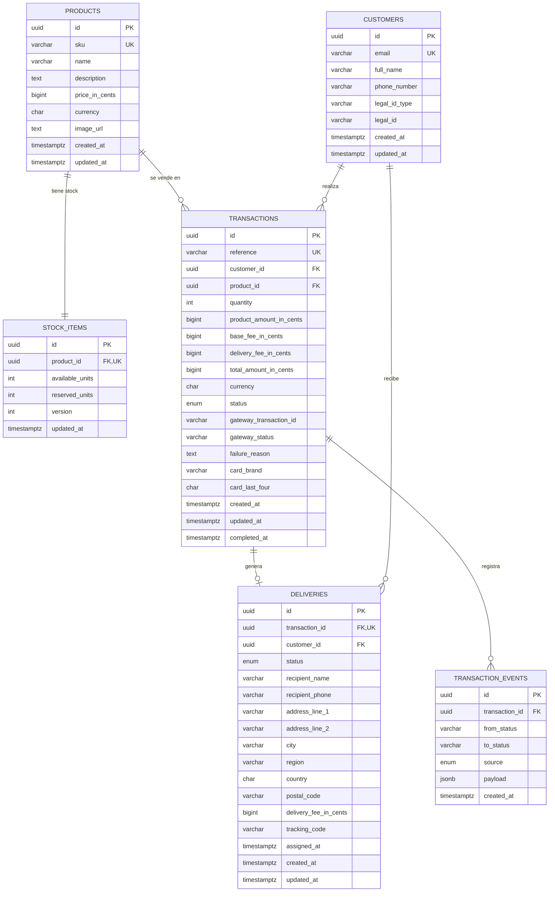

# Modelo de datos

PostgreSQL. Todos los importes se guardan en **centavos** (`BIGINT`) para evitar errores de
redondeo con decimales, y toda marca de tiempo es `TIMESTAMPTZ`.

## Diagrama entidad-relación

## Decisiones de diseño

### `stock_items` separada de `products`

El stock cambia con cada compra mientras que los datos del producto son casi inmutables.
Tenerlo en su propia tabla permite bloquear la fila de stock (`SELECT ... FOR UPDATE`) durante
una compra sin bloquear el catálogo, y expone `stock` como recurso propio de la API.

### Reserva de unidades

`stock_items` distingue `available_units` de `reserved_units`. Al crear una transacción en
`PENDING` las unidades pasan de disponibles a reservadas; el resultado del pago decide su
destino final:

| Resultado del pago | `available_units` | `reserved_units` |
| --- | --- | --- |
| `APPROVED` | sin cambio | `- cantidad` (unidades vendidas) |
| `DECLINED` / `VOIDED` / `ERROR` | `+ cantidad` (se liberan) | `- cantidad` |

Sin esta reserva, dos clientes podrían pagar la última unidad simultáneamente porque la
llamada al gateway no es instantánea. La columna `version` añade bloqueo optimista como
segunda defensa ante escrituras concurrentes.

### Datos sensibles

**Nunca se persiste el número completo de la tarjeta, la fecha de expiración ni el CVC.**
El PAN viaja directamente del navegador al gateway para ser tokenizado; el backend solo
almacena `card_brand` y `card_last_four`, que es lo mínimo para que el cliente reconozca su
compra. El token de la tarjeta se usa una sola vez y tampoco se guarda.

### Identidad del cliente

`customers.email` es único y se normaliza a minúsculas antes de persistirlo, de modo que un
mismo comprador que vuelve al checkout reutiliza su registro en lugar de duplicarse.

### `reference` como número de transacción

La PK es un UUID interno. Hacia afuera se expone `reference`, una cadena única e irrepetible
que también viaja al gateway como identificador del pago, lo que permite conciliar ambos
sistemas y hace la creación de transacciones idempotente frente a reintentos del cliente.

### `transaction_events`

Bitácora append-only de cada cambio de estado, con su origen (`API`, `GATEWAY_WEBHOOK`) y el
payload recibido. Sirve para auditoría y para descartar webhooks duplicados o desordenados
del gateway sin corromper el estado de la transacción.

## Estados

| Tabla | Estados |
| --- | --- |
| `transactions.status` | `PENDING` → `APPROVED` \| `DECLINED` \| `VOIDED` \| `ERROR` |
| `deliveries.status` | `PENDING` → `ASSIGNED` → `SHIPPED` → `DELIVERED` \| `CANCELLED` |
| `transaction_events.source` | `API`, `GATEWAY_WEBHOOK` |
